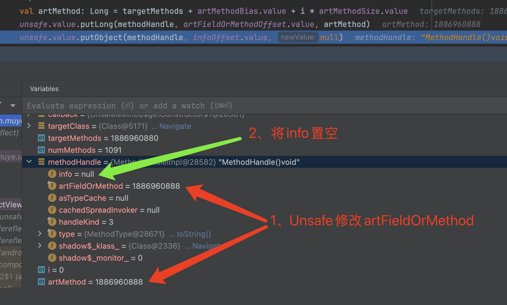

# Unsafe反射

本文介绍Android中一种基于**Unsafe**来进行反射调用的**技巧**。

简单来说，就是使用Unsafe类的方法，获取某个类/对象的方法或者属性。

为什么不直接使用反射呢？

对比直接使用反射，这个技巧作用优势是：

1. **可以实现在Android P(9)及以上系统对Hidden Api的调用**。在Android P(9)及以上系统，不允许反射调用系统方法，因此反射受到很大的限制。使用Unsafe的好处是不涉及native代码，并且稳定性较高。
2. **可以在不调用构造函数的前提下创建JAVA对象**。结合对属性/方法的反射赋值/调用，可以起到模拟新的构造函数的效果。这适用一些特殊的场景，例如Json反序列化、bug修复等。

这两个具体作用会在后文做介绍，但是首先让我们来了解关于Unsafe反射的背景和具体实现细节。

> 题外话：
>
> 对于Unsafe反射，本人最早见于Gson库的[UnsafeAllocator.java](https://github.com/google/gson/blob/main/gson/src/main/java/com/google/gson/internal/UnsafeAllocator.java)类中，用于分配对象，而不调用它们的构造函数。
>
> 后续学习文章[一个通用的纯 Java 安卓隐藏 API 限制绕过方案](https://bbs.kanxue.com/thread-267189.htm)，了解到它更大的作用。因此把其中提到的技巧单独提取出来封装成Unsafe反射的工具类，后续可以应用于更多的场景。


# 一、背景

## 1、Unsafe

`sun.misc.Unsafe` 是 Java 中一个非公开的类，提供了许多低级别的操作接口，使开发者能够**直接操作内存**、**创建实例**、执行线程调度、以及控制字段的访问权限等。

想要进一步了解的同学，可以参考文章[Java魔法类：Unsafe应用解析](https://tech.meituan.com/2019/02/14/talk-about-java-magic-class-unsafe.html)。

>Unsafe虽然不属于java标准，存在使用风险，但是JAVA生态中大量框架、SDK、JDK本身，都有对Unsafe的使用。典型的例如**AbstractQueuedSynchronizer**，因此Android目前对于Unsafe并没有禁用。

这里我们使用Unsafe的目的：

1. **任意**访问和修改目标内存地址上的值。使用`Unsafe.getInt(long)`等方法做到。
2. **任意**访问和修改类的成员/静态变量。使用`Unsafe.getLong(Object, long)`、`Unsafe.putObject(Object, long, Object)`等方法做到。


## 2、MethodHandle

MethodHandle 是 **Java 7** 引入的一种新机制，位于 java.lang.invoke 包中，它提供了对 Java 方法和构造函数的低级别、动态调用方式。MethodHandle 是反射 API 的一种替代，它提供了一种更高效、更灵活的方式来调用方法、构造函数或字段，且支持静态类型检查。

以下是一个例子：

```java
// 查找静态方法
MethodHandles.Lookup lookup = MethodHandles.lookup();
MethodHandle staticMethodHandle = lookup.findStatic(Math.class, "max", MethodType.methodType(int.class, int.class, int.class));

// 调用静态方法
int result = (int) staticMethodHandle.invokeExact(5, 10);
```

`MethodHandle`是一个抽象类，实现类为[MethodHandleImpl](https://cs.android.com/android/platform/superproject/main/+/main:libcore/ojluni/src/main/java/java/lang/invoke/MethodHandleImpl.java;l=39;drc=0a293aabaef57434b7cde9f431bacf6dc3ee7fe2?q=MethodHandleImpl&ss=android%2Fplatform%2Fsuperproject%2Fmain)，我们来看一下两者的结构：

```java
public abstract class MethodHandle {
  private final MethodType type = null;
  private MethodType nominalType;
  private MethodHandle cachedSpreadInvoker;
  protected final int handleKind = 0;

  // The ArtMethod* or ArtField* associated with this method handle (used by the runtime).
  //1、`实际是ArtMethod或ArtField指针
  protected final long artFieldOrMethod = 0;
  ...
}

static final public class MethodHandleImpl extends MethodHandle {
  	//2、MethodHandleInfo携带方法/属性信息
    private final MethodHandleInfo info = null;
  
  	static class HandleInfo implements MethodHandleInfo {
      //3、MethodHandleInfo实现类为HandleInfo，其中成员变量member为Field或Method或Constructor类型对象
      private final Member member;
      private final MethodHandle handle;
      ...
  	}
}

public
interface MethodHandleInfo {
  public String getName();
  ...
}

//4、可以看出Constructor、Method、Field，都实现了Member接口
public final
class Field extends AccessibleObject implements Member {
	...  
}
public final class Constructor<T> extends Executable {
  ...
}
public final class Method extends Executable  {
  ...
}
public abstract class Executable extends AccessibleObject
    implements Member, GenericDeclaration {
  ...
}
```

- `MethodHandle`虽然名称中有Method，但是它既代表方法，也代表属性。
- `MethodHandle.artFieldOrMethod`实际是ArtMethod或ArtField指针。如果我们替换某个MethodHandle的artFieldOrMethod为其他指针，是不是就能达到模拟其他方法/属性的效果呢？基本思路是这样的。
- `MethodHandleImpl.info`携带着方法/属性相关的信息，包括名称、类型等。`MethodHandleInfo`是接口，实现类为`MethodHandleImpl.HandleInfo`，它的成员变量`Member member`，实际就是Field或Method或Constructor类型对象。通常情况下，我们也无法通过MethodHandle拿到hidden api相关的Field或Method。


## 3、JAVA方法和Native方法的映射关系

JAVA层反射相关类和Native层是有对应的关系。具体的对应关系在[/art/runtime/mirror](https://cs.android.com/android/platform/superproject/main/+/main:art/runtime/mirror/)目录中，因此我们操作JAVA层反射类时，实际是通过指针进行native方法调用来操作的。

具体而言，对应关系如下：

### 3.1、Class.java对应class.h

[Class.java](https://cs.android.com/android/platform/superproject/main/+/main:libcore/ojluni/src/main/java/java/lang/Class.java)

```java
public final class Class<T> implements java.io.Serializable,
                              GenericDeclaration,
                              Type,
                              AnnotatedElement {
  ...
  //成员变量列表指针
  private transient long iFields;
  //静态变量列表指针
  private transient long sFields;
  //方法列表指针，包括构造方法、静态方法、成员方法
  private transient long methods;
  ...
}
```

[class.h](https://cs.android.com/android/platform/superproject/main/+/main:art/runtime/mirror/class.h)

```c++
// C++ mirror of java.lang.Class
class MANAGED Class final : public Object {
	...
  // instance fields
  //
  // These describe the layout of the contents of an Object.
  // Note that only the fields directly declared by this class are
  // listed in ifields; fields declared by a superclass are listed in
  // the superclass's Class.ifields.
  //
  // ArtFields are allocated as a length prefixed ArtField array, and not an array of pointers to
  // ArtFields.
  uint64_t ifields_;

  // Pointer to an ArtMethod length-prefixed array. All the methods where this class is the place
  // where they are logically defined. This includes all private, static, final and virtual methods
  // as well as inherited default methods and miranda methods.
  //
  // The slice methods_ [0, virtual_methods_offset_) are the direct (static, private, init) methods
  // declared by this class.
  //
  // The slice methods_ [virtual_methods_offset_, copied_methods_offset_) are the virtual methods
  // declared by this class.
  //
  // The slice methods_ [copied_methods_offset_, |methods_|) are the methods that are copied from
  // interfaces such as miranda or default methods. These are copied for resolution purposes as this
  // class is where they are (logically) declared as far as the virtual dispatch is concerned.
  //
  // Note that this field is used by the native debugger as the unique identifier for the type.
  uint64_t methods_;

  // Static fields length-prefixed array.
  uint64_t sfields_;
  ...
}
```

- 可以看到`iFields`、`sFields`、`methods_`等字段都有对应关系，并且两者实际是**同一块内存**。以`methods_`为例，看看指向的具体数据结构是什么。

[class-inl.h](https://cs.android.com/android/platform/superproject/main/+/main:art/runtime/mirror/class-inl.h)

```c++
inline LengthPrefixedArray<ArtMethod>* Class::GetMethodsPtr() {
  //将methods_强转成LengthPrefixedArray<ArtMethod>*
  return reinterpret_cast<LengthPrefixedArray<ArtMethod>*>(
      static_cast<uintptr_t>(GetField64(OFFSET_OF_OBJECT_MEMBER(Class, methods_))));
}
```

- 根据上面的代码看出，`methods_`实际是**LengthPrefixedArray\<ArtMethod>**指针。

[length_prefixed_array.h](https://cs.android.com/android/platform/superproject/main/+/main:art/libartbase/base/length_prefixed_array.h)

```c++
//1、LengthPrefixedArray是模版类
template<typename T>
class LengthPrefixedArray {
  ...
  static size_t OffsetOfElement(size_t index,
                                size_t element_size = sizeof(T),
                                size_t alignment = alignof(T)) {
    DCHECK_ALIGNED_PARAM(element_size, alignment);
    //2、offsetof(LengthPrefixedArray<T>, data_)表示data_的偏移
    //alignment是T类型需要的偏移，RoundUp表示将偏移量向上取整到指定的对齐边界（alignment）。这确保了数据的地址是对齐到合理的边界。
    //找到data_的真正偏移后，就可以根据index计算元素的偏移了
    return RoundUp(offsetof(LengthPrefixedArray<T>, data_), alignment) + index * element_size;
  }
  ...
private:
  T& AtUnchecked(size_t index, size_t element_size, size_t alignment) {
    return *reinterpret_cast<T*>(
      	//3、获取某个下标的元素，计算方式为指针 + 元素起始地址的偏移。为什么要计算偏移，因为size_字段需要进行内存对齐，而对齐的大小需要根据T的大小来计算的
        reinterpret_cast<uintptr_t>(this) + OffsetOfElement(index, element_size, alignment));
  }
  //1、size_表示数组元素的个数
  uint32_t size_;
  //2、字节数组指针
  uint8_t data_[0];
}
```

- **LengthPrefixedArray**的第一个成员为`size`，记录了数组的大小。
- `data_`是数组指针，实际就是[ArtMethod](https://cs.android.com/android/platform/superproject/main/+/main:art/runtime/art_method.h)类型数组。要获取`data_`的地址，需要计算`data_`相对应起始地址的偏移，这个偏移和内存对齐有关，而LengthPrefixedArray又是模板类，因此需要结合**元素类型T**的内存对齐计算。
- `data_`是数组指针，对于`iFields`、`sFields`则指向[ArtField](https://cs.android.com/android/platform/superproject/main/+/main:art/runtime/art_field.h;)类型数组。


### 3.2、Executable.java对应Executable.h

[Executable.java](http://aospxref.com/android-11.0.0_r21/xref/libcore/ojluni/src/main/java/java/lang/reflect/Executable.java)

```java
public abstract class Executable extends AccessibleObject
    implements Member, GenericDeclaration {
	...
    private int accessFlags;
  	//和native层的art_method_对应
    private long artMethod; 
    private Class<?> declaringClass;   
    private Class<?> declaringClassOfOverriddenMethod;   
    private int dexMethodIndex;
  ...
}
```

[executable.h](http://aospxref.com/android-11.0.0_r21/xref/art/runtime/mirror/executable.h)

```c++
// C++ mirror of java.lang.reflect.Executable.
class MANAGED Executable : public AccessibleObject {
  ...
private:
  uint16_t has_real_parameter_data_;
  HeapReference<mirror::Class> declaring_class_;
  HeapReference<mirror::Class> declaring_class_of_overridden_method_;
  HeapReference<mirror::Array> parameters_;
  //art_method_其实是ArtMethod指针
  uint64_t art_method_;
  uint32_t access_flags_;
  uint32_t dex_method_index_;
}
```

- `Executable`是Method和Contructor的父类，它的`Executable.artMethod`和native层的`art_method_`对应，实际是ArtMethod指针。
- 要反射调用某个Method，实际是通过`ArtMethod`指针来调用的。


# 二、方案

## 1、原理

根据前面的背景我们了解到：

1. MethodHandle访问的方法或属性，实际和`MethodHandle.artFieldOrMethod`指针有关，取决于这个指针指向哪个ArtMethod或ArtField。
2. `Class`的`methods_`、`iFields`、`sFields`则都是一个LengthPrefixedArray\<*>指针，它存储着该类的所有ArtMethod/ArtField对象。

根据上述结论，传入某个类的方法名和参数类型列表，可以这样获得目标**方法**：

1. 通过JAVA层的`Class.methods`获得`LengthPrefixedArray<ArtMethod>`指针，遍历该数组中的每个ArtMethod对象指针。
2. 临时创建的一个MethodHandle(通过任意一个我们有权限访问的方法)，将其`artFieldOrMethod`修改为我们的前面的ArtMethod对象指针，就可以通过这个MethodHandle来方法该指针对应的方法信息。
3. 匹配这些信息，包括方法名和参数类型列表，从而找到目标方法。
4. 通过MethodHandle获得成员`MethodHandleImpl.HandleInfo.Member member`，这就是我们要获取的Method对象。进而可以使用该Method对象进行反射调用了。

获取目标属性的过程也是类似的。

问题是，我们怎么做到上述的每一步？这就需要Unsafe的协助。


## 2、实现

### 2.1、遍历LengthPrefixedArray

根据LengthPrefixedArray的结构我们知道，下标为**index**的ArtMethod对象的地址为：

```shell
LengthPrefixedArray*(起始指针) + data_的偏移 + index * artMethodSize(ArtMethod对象大小)
```

因此首先我们要获取LengthPrefixedArray指针。

```kotlin
private val methodsOffset = lazy {
       //0、通过unsafe，可以获取字段methods在Class.java中的偏移，进而读写它的值
  unsafe.value.objectFieldOffset(ClassHelper.MyClass::class.java.getDeclaredField("methods"))
    }

//1、获取目标类.methods_的值，也就是LengthPrefixedArray*
val targetMethods = unsafe.value.getLong(targetClass, methodsOffset.value)
```

使用unsafe，获得`methods`字段在`Class.java`中的偏移，进而获得目标类(targetClass)中`methods`字段的值，也就是**LengthPrefixedArray***指针。

需要注意的是，这里使用的是**ClassHelper.MyClass**，是根据`Class.java`构造的拥有同样成员变量的类，因此需要保证两种的成员变量一致，才能读取到相同的偏移。

为什么不直接读取`Class.java`呢，因为由于hidden api的限制，我们无法通过反射读取`Class.java`中的成员变量。

后面要获取Executable、MethodHandle等成员变的偏移，我们都使用这个技巧，不再赘述。

此外我们还需要知道两个信息，即**data_的偏移**和**ArtMethod对象大小**。


#### 2.1.1、data_的偏移

```java
@Keep
static final class NeverCall {
    ...
    public NeverCall() {
    }
    ...
}
```

由于所有类的`LengthPrefixedArray.data_`字段的偏移都是一样的，可以通过一个辅助类**NeverCall**，获取它的`LengthPrefixedArray.data_`字段的偏移即可。

具体如下：

```kotlin
private val methodOffset = lazy {
       //0、通过unsafe，可以获取字段artMethod在Executable.java中的偏移，进而读写它的值
  unsafe.value.objectFieldOffset(ClassHelper.Executable::class.java.getDeclaredField("artMethod"))
    }

private val artMethodBias = lazy {
  		//1、获取NeverCall类的LengthPrefixedArray的指针，即起始地址
      val neverCallMethods =
          unsafe.value.getLong(ClassHelper.NeverCall::class.java, methodsOffset.value)
  		//2、获取NeverCall构造方法对应的artMethod的值，也就是底层ArtMethod对象的地址。构造方法是LengthPrefixedArray数组中的第一个方法。
      val firstMethodPtr = ClassHelper.NeverCall::class.java.getConstructor().run {
          isAccessible = true
          unsafe.value.getLong(this, methodOffset.value)
      }      
  		//3、两者的差值，就是data_字段的偏移量
      val artMethodBias = firstMethodPtr - neverCallMethods
      artMethodBias
  }
```

- 获取NeverCall类的LengthPrefixedArray的指针，即起始地址。
- 获取NeverCall构造方法对应的artMethod的值，也就是底层ArtMethod对象的地址。构造方法是LengthPrefixedArray数组中的第一个方法，在其他类中可能不是这样的，但是在我们构造的NeverCall中是这样的。
- 两者的差值，就是data_字段的偏移量。我们把这个结果存储下来，其他类也是一样的，可以直接使用。


#### 2.1.1、ArtMethod对象大小

```java
@Keep
static final class NeverCall {
   	...
    public NeverCall() {
    }

    public static void s() {
    }

    public static void t() {
    }
}
```

我们再次给NeverCall添加两个静态方法s()、t()。s、t在LengthPrefixedArray中应该是**连续**的，因此**两者指针的差值，就正好是一个ArtMethod对象的大小**。

```kotlin
private val artMethodSize = lazy {
  	//1、获取方法s的成员Method.artMethod的值，也就是其对应的ArtMethod指针
    val artMethodPtrS = ClassHelper.NeverCall::class.java.getDeclaredMethod("s").run {
        isAccessible = true
        unsafe.value.getLong(this, methodOffset.value)
    }
    //2、获取方法t的成员Method.artMethod的值，也就是其对应的ArtMethod指针
    val artMethodPtrT = ClassHelper.NeverCall::class.java.getDeclaredMethod("t").run {
        isAccessible = true
        unsafe.value.getLong(this, methodOffset.value)
    }
    //3、两者连续，因此差值就正好是一个ArtMethod对象的大小
    artMethodPtrT - artMethodPtrS
}
```

这个技巧同样有趣，使得我们在不了解ArtMethod具体数据结构下，就可以获得ArtMethod的大小。在其他hook场景也可能会使用到这个技巧。


#### 2.1.3、遍历

```kotlin
//2、LengthPrefixedArray的第一个成员是ArtMethod数组的大小
val numMethods = unsafe.value.getInt(targetMethods)
```

- LengthPrefixedArray的一个成员为ArtMethod数组的大小。

有了上述基础以后，我们就可以遍历`LengthPrefixedArray*`了：

```kotlin
private fun foreachMethods(targetClass: Class<*>, callback: Callback) = runCatching {
      //1、获取LengthPrefixedArray*
      val targetMethods = unsafe.value.getLong(targetClass, methodsOffset.value)
      if (targetMethods == 0L) {
          Log.e(TAG, "exemptAllByUnsafe: methods is null")
          return@runCatching
      }

      //2、LengthPrefixedArray的第一个成员是ArtMethod数组的大小
      val numMethods = unsafe.value.getInt(targetMethods)
      Log.d(TAG, "exemptAllByUnsafe: numMethods = $numMethods")
      if (numMethods == 0) {
          return@runCatching
      }

      val methodHandle = MethodHandles.lookup()
          .unreflect(ClassHelper.NeverCall::class.java.getDeclaredMethod("s").apply {
              isAccessible = true
          })
  		//3、开始遍历方法，进行匹配
      for (i in 0 until numMethods) {        	
        	//4、根据规则，获取ArtMethod*
        	val artMethod: Long = targetMethods + artMethodBias.value + i * artMethodSize.value
          ...
      }
  }

```


### 2.2、获取Method对象

```kotlin
val methodHandle = MethodHandles.lookup()
          .unreflect(ClassHelper.NeverCall::class.java.getDeclaredMethod("s").apply {
              isAccessible = true
          })
```

首先我们构造了一个MethodHandle对象，它代表的是NeverCall的静态方法s()。

通过使用unsafe替换这个MethodHandle对象的成员，就可以成功将它伪装成其他任意方法。


#### 2.2.1、修改artMethod

根据前面的信息，在遍历LengthPrefixedArray并获取到`artMethod`后，可以通过unsafe修改`MethodHandle.artFieldOrMethod`，从而将它伪装成该`artMethod`代表的方法。

```kotlin
val artFieldOrMethodOffset = lazy {
        unsafe.value.objectFieldOffset(ClassHelper.MethodHandle::class.java.getDeclaredField("artFieldOrMethod"))
    }

val infoOffset = lazy {
        unsafe.value.objectFieldOffset(ClassHelper.MethodHandleImpl::class.java.getDeclaredField("info"))
    }

private fun foreachMethods(targetClass: Class<*>, callback: Callback) = runCatching {
      ...
  		//1、构造一个临时的methodHandle
      val methodHandle = MethodHandles.lookup()
          .unreflect(ClassHelper.NeverCall::class.java.getDeclaredMethod("s").apply {
              isAccessible = true
          })
  		//2、开始遍历方法
      for (i in 0 until numMethods) {        	
        	//3、根据规则，获取ArtMethod*
        	val artMethod: Long = targetMethods + artMethodBias.value + i * artMethodSize.value
        	//4、使用unsafe修改artFieldOrMethod
        	unsafe.value.putLong(methodHandle, artFieldOrMethodOffset.value, artMethod)
        	//5、使用unsafe将MethodHandleImpl.info成员置空
        	unsafe.value.putObject(methodHandle, infoOffset.value, null)
          ...
      }
  }
```

处理修改`MethodHandle.artFieldOrMethod`外，还需要将`MethodHandleImpl.info`成员置空，这是因为我们需要重新给这个成员赋值，从而获得**artMethod**对应的方法的信息。



其他成员变量我们则不关心，因为这不影响对MethodHandle的后续使用。


#### 2.2.2、revealDirect()方法

要给`MethodHandleImpl.info`重新赋值，具体来说，我们调用**MethodHandle.Lookup.revealDirect()**方法，给`MethodHandleImpl.info`成员重新赋值。

看看`revealDirect()`方法是怎么做到的：

```java
//MethodHandles.java
public MethodHandleInfo revealDirect(MethodHandle target) {  
  	//1、将MethodHandle强转成MethodHandleImpl
    MethodHandleImpl directTarget = getMethodHandleImpl(target);
  	//2、调用其reveal()方法
    MethodHandleInfo info = directTarget.reveal();

    try {
      	//3、检查当前lookupClass是否有权限方法目标方法的信息
        checkAccess(lookupClass(), info.getDeclaringClass(), info.getModifiers(),
                info.getName());
    } catch (IllegalAccessException exception) {
        throw new IllegalArgumentException("Unable to access memeber.", exception);
    }

    return info;
}

//MethodHandleImpl.java
MethodHandleInfo reveal() {
    if (info == null) {
      	//4、当info为空，就调用getMemberInternal()这个native方法取获取。这也是为什么前面我们要将info置空的原因。
        final Member member = getMemberInternal();
        info = new HandleInfo(member, this);
    }

    return info;
}

/**
 * Materialize a member from this method handle's ArtField or ArtMethod pointer.
 */
public native Member getMemberInternal();
```

[art/runtime/native/java_lang_invoke_MethodHandleImpl.cc](https://cs.android.com/android/platform/superproject/main/+/main:art/runtime/native/java_lang_invoke_MethodHandleImpl.cc)

```c++
static jobject MethodHandleImpl_getMemberInternal(JNIEnv* env, jobject thiz) {
  ScopedObjectAccess soa(env);
  StackHandleScope<2> hs(soa.Self());
  //5、获取底层MethodHandleImpl指针
  Handle<mirror::MethodHandleImpl> handle = hs.NewHandle(
      soa.Decode<mirror::MethodHandleImpl>(thiz));

  // Check the handle kind, we need to materialize a Field for field accessors,
  // a Method for method invokers and a Constructor for constructors.
  //6、获取handle_kind，用来区分MethodHandle代表的是方法还是属性
  const mirror::MethodHandle::Kind handle_kind = handle->GetHandleKind();

  MutableHandle<mirror::Object> h_object(hs.NewHandle<mirror::Object>(nullptr));
  if (handle_kind >= mirror::MethodHandle::kFirstAccessorKind) {
    //7、属性，读取ArtField指针，调用CreateFromArtField()创建Field对象
    ArtField* const field = handle->GetTargetField();
    h_object.Assign(
        mirror::Field::CreateFromArtField(soa.Self(), field, /* force_resolve= */ false));
  } else {
    //8、方法，则读取ArtMethod指针，CreateFromArtMethod()创建Method对象
    ArtMethod* const method = handle->GetTargetMethod();
    if (method->IsConstructor()) {
      h_object.Assign(
          mirror::Constructor::CreateFromArtMethod<kRuntimePointerSize>(soa.Self(), method));
    } else {
      h_object.Assign(mirror::Method::CreateFromArtMethod<kRuntimePointerSize>(soa.Self(), method));
    }
  }

  ...

  return soa.AddLocalReference<jobject>(h_object.Get());
}
```

根据上面的源码可看出，`revealDirect()`最终就是通过`MethodHandle.artFieldOrMethod`来构造对应的Field/Method对象。由于在调用`revealDirect()`前，`MethodHandle.artFieldOrMethod`就被我们修改成目标方法的指针，这里获取到的当前就是目标方法的信息了。

接下来注意上面的步骤3，由于我们可能要访问类的私有方法或成员，我们需要使用`MethodHandles.privateLookupIn()`，而这个方法在Android 33才可用。

怎么兼容其他版本呢？

观察源码：

```java
public static Lookup privateLookupIn(Class<?> targetClass, Lookup lookup) throws IllegalAccessException {        
        ...
        return new Lookup(targetClass);
    }
```

可以看出`privateLookupIn()`方法非常简单，实际就是传入targetClass到Lookup的构造函数，而这个构造函数是包可见性的。我们使用unsafe同样可以轻松绕过这点：

```kotlin
private val lookupClassOffset = lazy {
        unsafe.value.objectFieldOffset(ClassHelper.Lookup::class.java.getDeclaredField("lookupClass"))
    }

    private val allowedModesOffset = lazy {
        unsafe.value.objectFieldOffset(ClassHelper.Lookup::class.java.getDeclaredField("allowedModes"))
    }

@RequiresApi(Build.VERSION_CODES.O)
fun revealDirect(targetClass: Class<*>, methodHandle: java.lang.invoke.MethodHandle) {
    if (Build.VERSION.SDK_INT >= Build.VERSION_CODES.TIRAMISU) {
        MethodHandles.privateLookupIn(targetClass, MethodHandles.lookup())
            .revealDirect(methodHandle)
    } else {
        //Compatible with lower versions, self-test Android O is effective
      	//1、不使用构造方法，创建一个lookup对象
        val lookup =
            unsafe.value.allocateInstance(MethodHandles.Lookup::class.java) as MethodHandles.Lookup
      	//2、直接给Lookup.lookupClass和Lookup.allowedModes赋值，从而等价于调用了privateLookupIn()方法
        unsafe.value.putObject(lookup, lookupClassOffset.value, targetClass)
        unsafe.value.putInt(
            lookup,
            allowedModesOffset.value,
            Modifier.PUBLIC or Modifier.PRIVATE or Modifier.PROTECTED or Modifier.STATIC
        )
        lookup.revealDirect(methodHandle)
    }
}
```

至此，我们说明了**MethodHandle.Lookup.revealDirect()**方法重新获取`MethodHandleImpl.info`信息的可行性。


#### 2.2.3、获取Method对象

有了上述结论，我们就可以动手获取方法信息及Method对象了：

```kotlin
private fun foreachMethods(targetClass: Class<*>, callback: Callback) = runCatching {
    ...

    val methodHandle = MethodHandles.lookup()
        .unreflect(ClassHelper.NeverCall::class.java.getDeclaredMethod("s").apply {
            isAccessible = true
        })
    //2、开始遍历方法
    for (i in 0 until numMethods) {        	
        //3、根据规则，获取ArtMethod*
        val artMethod: Long = targetMethods + artMethodBias.value + i * artMethodSize.value
        //4、使用unsafe修改artFieldOrMethod
        unsafe.value.putLong(methodHandle, artFieldOrMethodOffset.value, artMethod)
        //5、使用unsafe将MethodHandleImpl.info成员置空
        unsafe.value.putObject(methodHandle, infoOffset.value, null)
      	//6、revealDirect()重新填充MethodHandleImpl.info对象
      	UnsafeClass.revealDirect(targetClass, methodHandle)
      	//7、通过unsafe读取出MethodHandleImpl.info成员,它记录了方法信息
      	val info = unsafe.value.getObject(methodHandle, infoOffset.value) as MethodHandleInfo
      	//8、通过unsafe读取HandleInfo.member，这个成员就是对应的Field/Method/Constructor对象
        val member =(unsafe.value.getObject(info, memberOffset.value) as Executable).apply {isAccessible = true}
      	//todo 反射访问member
    }
}
```

这里关键两步就是：

1. 通过unsafe读取出MethodHandleImpl.info成员,它记录了方法信息。通过这个信息进行匹配，就可以找到目标方法。
2. 通过unsafe读取HandleInfo.member，这个成员就是对应的Field/Method/Constructor对象。有了这个对象，就可以进行反射调用而不受到hidden api的限制。

另外，构造方法的获取和普通方法完全一致，唯一不同的就是最新得到的member对象的类型。


### 2.3、获取Field对象

前面介绍的是获取Method对象的方法，获取Field对象其实主体过程是完全一致的。

区别是：

1. 静态属性列表记录对应的LengthPrefixedArray记录在`Class.sField`字段中；成员属性列表记录的LengthPrefixedArray则记录在`Class.iField`字段中。
2. 遍历的是ArtField，因此需要计算`artFieldSize`和`artFieldBias`，两者需要通过NeverCall.a、NeverCall.b两个静态变量来计算。

```java
@Keep
static final class NeverCall {
    private static int a;
    private static int b;
  	...
}
```


# 三、应用场景

## 1、调用Hidden Api

Hidden Api机制，限制的是通过`Class.getDeclaredMethod()`、`Class.getDeclaredField()`等方法获取Hidden的Field/Method对象。一旦访问，则会抛出NoSuchMethodException、NoSuchFieldException。

另外，直接通过MethodHandle访问，也会抛出异常。

但是前文我们通过Unsafe反射，成功通过修改`MethodHandle.artFieldOrMethod`的方式，从而获取到Field/Method对象。因而可以绕过系统的检查机制。


## 2、模拟构造函数

所谓模拟构造函数，其实就是先使用`Unsafe.allocateInstance()`来分配对象内存，然后使用Unsafe反射去初始化该对象的成员或者调用初始化方法，从而模拟构造函数的过程。

在**revealDirect()方法**中，我们就使用这个技巧来模拟`MethodHandles.privateLookupIn()`方法。

这里再介绍一个现实的应用。

在Android 7.1.2及以下版本，有这样一个系统Bug：

- 在调用`android.graphics.pdf.PdfRenderer`的构造方法时，如果传入的是一个损坏的PDF文件，那么会抛出JAVA异常，这个异常可以被捕获。但是之后，即使使用完整的PDF文件创建PdfRenderer，仍然会导致进程崩溃。

```kotlin
private fun testAndroidBug(context: Context) {
        //1、创建一个空白的pdf文件
        val file = File.createTempFile("temp", "pdf")
        runCatching {
            //2、使用空白pdf构造PdfRenderer，会抛出异常，但是可以捕获
            val pdf =
                PdfRenderer(ParcelFileDescriptor.open(file, ParcelFileDescriptor.MODE_READ_ONLY))
            pdf?.close()
        }
        //3、创建一个完整的pdf文件
        val pdfFile = File.createTempFile("test", "pdf")
        pdfFile.outputStream().use {
            context.resources.openRawResource(R.raw.test).apply {
                copyTo(it)
                close()
            }
        }
        //4、使用完整pdf文件创建PdfRenderer，触发崩溃
        val pdf2 =
            PdfRenderer(ParcelFileDescriptor.open(pdfFile, ParcelFileDescriptor.MODE_READ_ONLY))
        if (pdf2 != null) {
            val page = pdf2.openPage(0)
            val bitmap = Bitmap.createBitmap(page.width, page.height, Bitmap.Config.ARGB_8888)
            page.render(bitmap, null, null, PdfRenderer.Page.RENDER_MODE_FOR_DISPLAY)
            page.close()
            pdf2.close()
        }
    }
```

这个Bug的原因是PdfRenderer的构造方法中，在Native层会维护一个单例，当所有的PdfRenderer对象都回收后，这个单例才会被释放，而这就需要维护一个对PdfRenderer对象数量的计数。

但是当传入一个损坏的PDF文件，则会在PdfRenderer的构造方法中抛出异常，也就是对象虽然创建了，但是初始化过程却只完成了一部分。

当这个只完成了一部分的对象被回收时，`PdfRenderer.finalize()`方法被调用，会导致PdfRenderer对象数量的计数多减少了1，从而使得计数不准确了。

[PdfRenderer.java](http://androidxref.com/7.0.0_r1/xref/frameworks/base/graphics/java/android/graphics/pdf/PdfRenderer.java)

```java
public PdfRenderer(@NonNull ParcelFileDescriptor input) throws IOException {
    ...
		//1、构造函数执行到这里，mInput就有值了
    mInput = input;
  	//2、nativeCreate中抛出异常，导致初始化中断了，但是对象已经存在
    mNativeDocument = nativeCreate(mInput.getFd(), size);
    mPageCount = nativeGetPageCount(mNativeDocument);
    mCloseGuard.open("close");
}

@Override
protected void finalize() throws Throwable {
    try {      	
        mCloseGuard.warnIfOpen();
      	//3、对象回收时，mInput却不为空，导致doClose()被调用了，从而使得底层计数不准确
        if (mInput != null) {
            doClose();
        }
    } finally {
        super.finalize();
    }
}
```

要解决这个问题，我们就可以模拟PdfRenderer的构造函数，使得当`nativeCreate()`抛出异常时，将`mInput`置空，从而避免`doClose()`方法被调用。

具体实现，可以见后续提供的源码。


# 四、缺陷与不足

Unsafe反射，虽然可以绕过Hidden Api的限制，但是有一些不足：

1. 使用Unsafe本质上还是直接访问和修改内存，一旦出错可能造成虚拟机崩溃，风险比较大。
2. 使用到`Unsafe.getInt(long)`方法和`MethodHandles.Lookup`，都有Android版本限制。因此Unsafe反之只支持Android O(8.0)及以上版本。


# 五、写在最后

**1、源码下载**

https://github.com/835127729/UnsafeReflect


**2、免责声明**

本文涉及的代码，旨在展示和描述方案的可行性，可能存bug或者性能问题。

不建议未经修改验证，直接使用于生产环境。


**3、转载声明**

本文欢迎转载，**转载请注明出处**。


**4、留言讨论**

你是否也在现实开发中遇到类似的场景或者应用，是否有更多的意见和想法，欢迎留言一起学习讨论。


**5、欢迎关注**

如果你对更多的编程开发技巧、思路感兴趣的，欢迎关注我的栏目。

后续将提供更多优质内容，硬核干货。


# 参考文章

[一个通用的纯 Java 安卓隐藏 API 限制绕过方案](https://bbs.kanxue.com/thread-267189.htm)

[AndroidHiddenApiBypass](https://github.com/LSPosed/AndroidHiddenApiBypass)

[纯JAVA代码绕过Android S的HiddenApi限制](https://zhuanlan.zhihu.com/p/364884283)
